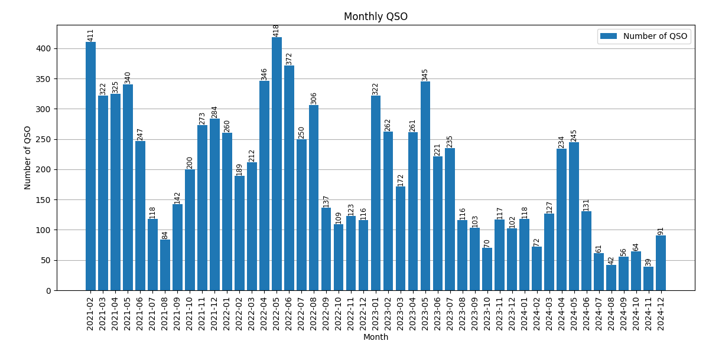

<picture align="center">
    <source media="(prefers-color-scheme: dark)" secset="docs/adiftools_logo.svg">
    
</picture>

----------------------

# adiftools: adif file utility tools for all amateur radio stations

| Item | Description |
| --- | --- |
| Testing |   |
| Package | |
| Meta | [](LICENSE)  |

## What is it?

**adiftools** is a Python package that provides utilities for ADIF data which is used for the QSO logging file format.

## Main Features

- **ADIF file parser**: read ADIF file and convert to Pandas DataFrame
  - Call signature:
    ```python
    ADIFParser.read_adi(file_path, enable_timestamp=False)
    ```
  - Parameter:
    - `file_path`: str or path-like or binary file-like
      - A path, or a Python file-like object of ADIF file to read
  - Returns:
    - `pd.DataFrame`
      - The created pandas.DataFrame instance includes QSO data from ADIF file 
  
  - Other Parameter:
    - `enable_timestamp`: bool, default: `False`
      - If True, add row named ['timestamp'] to DataFrame which is generated from ADIF file. The row ['timestamp'] is `datetime64[ns]` type and based on rows `'QSO_DATE'` and `'TIME_ON'`.

- **ADIF plot generator**: generate matplotlib plot from ADIF data (pandas.DataFrame)
  - Call signature:
    ```python
    adif_dataframe.plot_monthly(fname)
    ```
    Generate bar plot of monthly QSOs and save png or jpg file. 
  - Patameters:
    - `fname`: str or path-like or binary file-like
      - A path, or a Python file-like object of plot's PNG or JPG file
  - Returns:
    - `None`
  
    


## Install
Binary installers for the latest released version will be available at the [Python Package Index (PyPI)](https://pypi.org/) soon.

**NOT WORKING AT THIS MOMENT**
```sh
pip install adiftools
```

## Dependencies
- [Pandas](https://pandas.pydata.org)
- [numpy](https://numpy.org/doc/stable/index.html)
- [matplotlib](https://matplotlib.org)

## Licence
[MIT](LICENSE)
